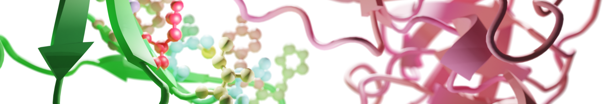
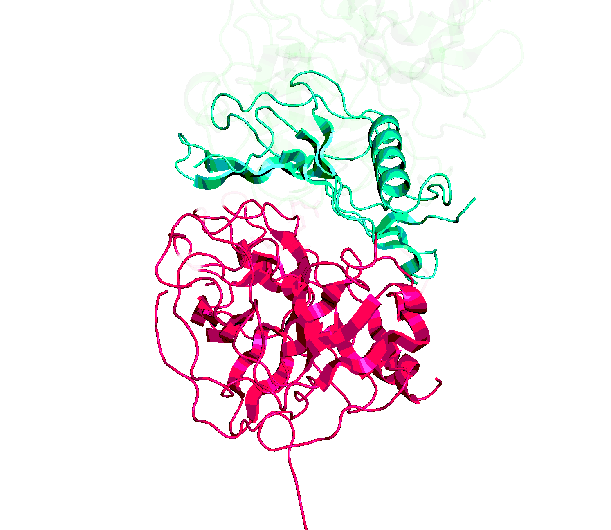
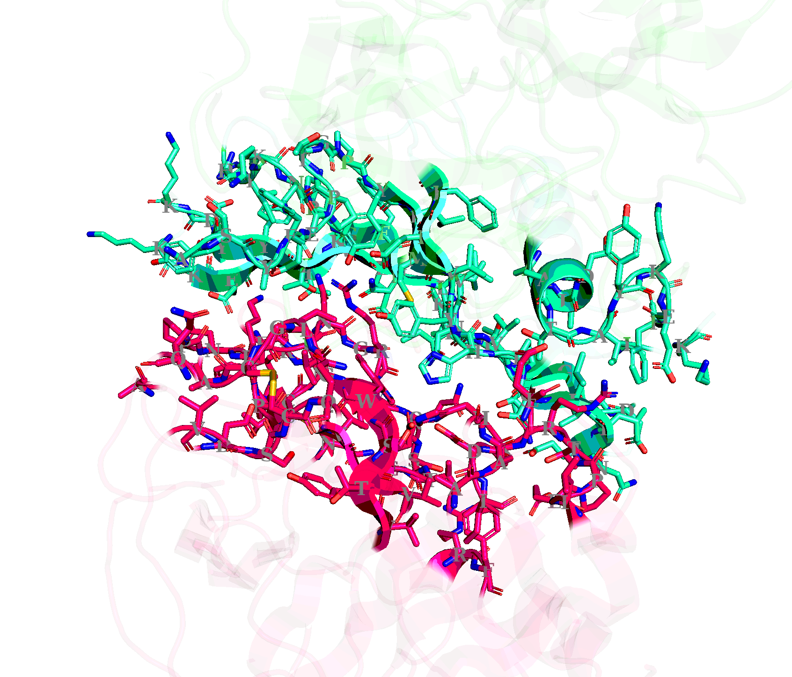

<div align="center">
# PPIRef
</div>

<p align="center">
  
</p>

PPIRef is a Python package for processing and analysing 3D structures of protein-protein interactions (PPIs). It is based on the PPIRef dataset.

# PPIRef dataset

PPIRef is a complete* and non-redundant dataset of protein-protein interactions (PPIs). It was constructed in three steps: (i) exhaustevily extract all putative protein dimers from PDB based on heavy atom contacts, (ii) filter out not proper PPIs based on buried surface area and other criteria, (iii) remove near-duplicate PPIs with iDist - a fast algorithm accurately approximating PPI alignment-based algorithms such as iAlign. See [our paper](https://arxiv.org/abs/2310.18515) for details.

<p align="center">
  
</p>

The PPIRef dataset can be downloaded from Zenodo (TBD soon). Alternatively, the dataset may be reconstructed from scratch with the following steps: (i) downloading and unpacking PDB (`scripts/download_pdb.sh` and `scripts/unpack_pdb.sh`), (ii) extracting dimer PPIs from all PDB files (`scripts/ppi_extractor.py`) and (iii) filtering and clustering PPIs (see below).

\* (with respect to PDB on June 20, 2023)

# PPIRef package

## Installation

To install the package, clone the repository and run `pip install .` in the root directory. The package was tested with Python 3.9.

Please see the `external/README.md` directory for the details on how to install the external software for comparing PPIs and calculating buried surface area (BSA).

## Extracting PPIs

The `PPIExtractor` class enables extracting PPIs from PDB files based on inter-atomic distances.

```python
from ppiref.extraction import PPIExtractor
from ppiref.definitions import PPIREF_TEST_DATA_DIR

# Initialize PPI extractor based on 10A contacts between heavy atoms (as in PPIRef)
# Additionally, caluclate buried surface area (BSA) of PPIs (slow)
ppi_dir = PPIREF_TEST_DATA_DIR / 'ppi_dir'
extractor = PPIExtractor(out_dir=ppi_dir, kind='heavy', radius=10., bsa=True)

# Extract all contact-based dimeric PPIs from a PDB file
pdb_file = PPIREF_TEST_DATA_DIR / '1bui.pdb'
extractor.extract(pdb_file)

# Extract a contact-based PPI between two specified chains (dimer)
extractor.extract(pdb_file, partners=['A', 'C'])

# Extract a contact-based PPI between three specified chains (trimer)
extractor.extract(pdb_file, partners=['A', 'B', 'C'])

# Extract a complete complex by setting high expansion radius around interface
ppi_complexes_dir = PPIREF_TEST_DATA_DIR / 'ppi_dir_complexes'
extractor = PPIExtractor(out_dir=ppi_complexes_dir, kind='heavy', radius=6., bsa=False, expansion_radius=1_000_000.)
extractor.extract(pdb_file, partners=['A', 'C'])
```

## Analysing PPIs

After the extraction, one can visualize the PPIs via a PyMOL wrapper and get their statistics.

```python
from ppiref.visualization import PyMOL
pymol = PyMOL()

# Visualize extracted PPIs in PyMOL session + static image
ppi_file = ppi_complexes_dir / 'bu/1bui_A_C.pdb'  # complex
pymol.display_ppi(ppi_file, sticks=False, letters=False, color_by_residues=False)
```

<p align="center">
  
</p>

```python
ppi_file = ppi_dir / 'bu/1bui_A_C.pdb'  # interface
pymol.display_ppi(ppi_file, sticks=True, letters=True, color_by_residues=False)
```

<p align="center">
  
</p>

```python
from ppiref.utils.ppi import PPI

# Get properties of a PPI
ppi = PPI(ppi_file)
ppi.stats
> {'KIND': 'heavy',
>  'EXTRACTION RADIUS': 10.0,
>  'EXPANSION RADIUS': 0.0,
>  'RESOLUTION': 2.65,
>  'STRUCTURE METHOD': 'x-ray diffraction',
>  'BSA': 898.378288445}
```

## Comparing PPIs

This package provides wrappers for iAlign and US-align (see `external/README.md`), as well as their scalable approximation iDist (see our [paper](https://arxiv.org/pdf/2310.18515.pdf)) for comparing PPI structures.

```python
from ppiref.comparison import IAlign, USalign, IDist

# Prepare near-duplicate PPIs from Figure 1 in the paper (https://arxiv.org/pdf/2310.18515.pdf)
extractor = PPIExtractor(out_dir=ppi_dir, kind='heavy', radius=6., bsa=False)
extractor.extract(PPIREF_TEST_DATA_DIR / '1p7z.pdb', partners=['A', 'C'])
extractor.extract(PPIREF_TEST_DATA_DIR / '3p9r.pdb', partners=['B', 'D'])
ppis = [PPIREF_TEST_DATA_DIR / 'p7/1p7z_A_C.pdb', PPIREF_TEST_DATA_DIR / 'p9/3p9r_B_D.pdb']

# Compare with iAlign (see external/README.md for installation)
ialign = IAlign()
ialign.compare(*ppis)
> {'PPI0': '1p7z_A_C', 'PPI1': '3p9r_B_D', 'IS-score': 0.95822, 'P-value': 8.22e-67, 'Z-score': 152.167, 'Number of aligned residues': 249, 'Number of aligned contacts': 347, 'RMSD': 0.37, 'Seq identity': 0.992}

# Compare with US-align (see external/README.md for installation)
usalign = USalign()
usalign.compare(*ppis)
> {'PPI0': '1p7z_A_C', 'PPI1': '3p9r_B_D', 'TM1': 0.992, 'TM2': 0.9965, 'RMSD': 0.3, 'ID1': 0.991, 'ID2': 0.996, 'IDali': 0.998, 'L1': 448, 'L2': 446, 'Lali': 445}

# Compare with iDist
idist = IDist()
idist.compare(*ppis)
> {'PPI0': '1p7z_A_C.pdb', 'PPI1': '3p9r_B_D.pdb', 'L2': 0.0026614179313795114, 'L1': 0.006036636849518753 'Cosine Similarity': 0.999777940667365}

# Compare PPIs pairwise with iDist
# (possible with other methods as well but has heavy quadratic complexity)
idist.compare_all_against_all(ppis, ppis)
>            PPI0          PPI1        L2        L1  Cosine Similarity
> 0  1p7z_A_C.pdb  1p7z_A_C.pdb  0.000000  0.000000           1.000000
> 1  1p7z_A_C.pdb  3p9r_B_D.pdb  0.002661  0.006037           0.999778
> 2  3p9r_B_D.pdb  1p7z_A_C.pdb  0.002661  0.006037           0.999778
> 3  3p9r_B_D.pdb  3p9r_B_D.pdb  0.000000  0.000000           1.000000
```

## Deduplicating PPIs

Since iDist is based on a simple vectorization of PPIs, it can be used to deduplicate them based on the Euclidean (L2) distance. The validated threshold used by default is 0.04, suitable for 6A heavy-atom interfaces.

```python
# Embed PPIs with iDist without comparing
idist.embed(ppis[0])
idist.embed(ppis[1])
idist.embeddings
> {'3p9r_B_D': array([0.02247098, 0.00224901, 0.03596857, 0.03821186, 0.03148652,
>         0.0404701 , 0.02247443, 0.02697991, 0.01798007, 0.03372832,
>         0.0044929 , 0.0382254 , 0.04607898, 0.01573758, 0.03933556,
>         0.0247265 , 0.0314755 , 0.01123243, 0.00449045, 0.01348696]),
>  '1p7z_A_C': array([0.02237079, 0.00223889, 0.03804226, 0.0391576 , 0.03134589,
>         0.04028928, 0.02237348, 0.02685891, 0.01789972, 0.03357791,
>         0.00447256, 0.0380533 , 0.04587724, 0.01566676, 0.03804791,
>         0.02461776, 0.0313348 , 0.01118212, 0.00447062, 0.01342645])}

# And then query for near-duplicates
idist.embed(ppis[1])
idist.query(idist.embeddings['1p7z_A_C'])
> (array([2.63417803e-09, 2.66141793e-03]),
>  array(['1p7z_A_C', '3p9r_B_D'], dtype=object))

# Or directly deduplicate them
idist.deduplicate_embeddings()
idist.embeddings
> {'3p9r_B_D': array([0.02247098, 0.00224901, 0.03596857, 0.03821186, 0.03148652,
>         0.0404701 , 0.02247443, 0.02697991, 0.01798007, 0.03372832,
>         0.0044929 , 0.0382254 , 0.04607898, 0.01573758, 0.03933556,
>         0.0247265 , 0.0314755 , 0.01123243, 0.00449045, 0.01348696])}
```

## Splitting PPIs

This package provides a unified approach to storing and processing data splits of PPIs.

```python
from ppiref.split import read_split, write_split

# Read prepared splits from a .json file in ./splits
# PPIRef50K used to train PPIformer
split = read_split('ppiref_filtered_clustered_04', full_paths=False)
split['whole'][:3]
> ['4q2p_A_B', '2q2g_A_B', '6q2a_H_K']

# Test set from non-leaking SKEMPI v2.0
split = read_split('skempi2_iclr24_split')
split['test'][:3]
> ['1B3S_A_D', '1B2U_A_D', '1BRS_A_D']

# DIPS set used to train EquiDock
split = read_split('dips_equidock')
split['train'][:3]
> ['1v6j_A_D', '2v6a_L_A', '2v6a_B_O']

# Write your own split (this will also run simple sanity checks)
split = {'train': ['1p7z_A_C'], 'test': ['3p9r_B_D', '1p7z_A_C']}
write_split('demo_split', source=PPIREF_TEST_DATA_DIR / 'ppi_dir', folds=split)
> UserWarning: Folds train and test are not disjoint.
> UserWarning: Split is not complete: 2 of 5 PPIs contained.
```

# TODO

Technical 
- [ ] PPIRef on Zenodo
- [ ] Docstrings

Enhancements
- [ ] Add RASA values to classify residues according to [Levy 2010](https://pubmed.ncbi.nlm.nih.gov/20868694/)
- [ ] Classify PPIs according to [Ofran2003](https://pubmed.ncbi.nlm.nih.gov/12488102/)

# References
If you find this repository useful, please cite our paper or the corresponding external software (see `external/README.md`).
```
@article{
  bushuiev2024learning,
  title={Learning to design protein-protein interactions with enhanced generalization},
  author={Bushuiev, Anton and Bushuiev, Roman and Filkin, Anatolii and Kouba, Petr and Gabrielova, Marketa and Gabriel, Michal and Sedlar, Jiri and Pluskal, Tomas and Damborsky, Jiri and Mazurenko, Stanislav and others},
  booktitle={The Twelfth International Conference on Learning Representations},
  year={2024}
}
```
